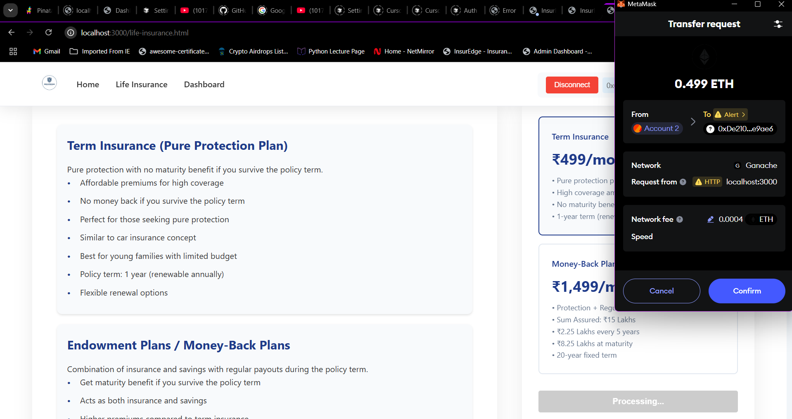
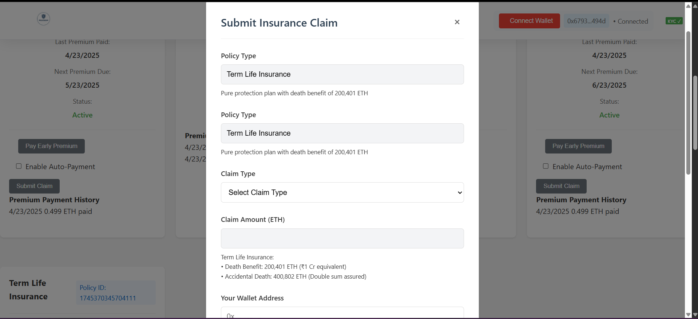
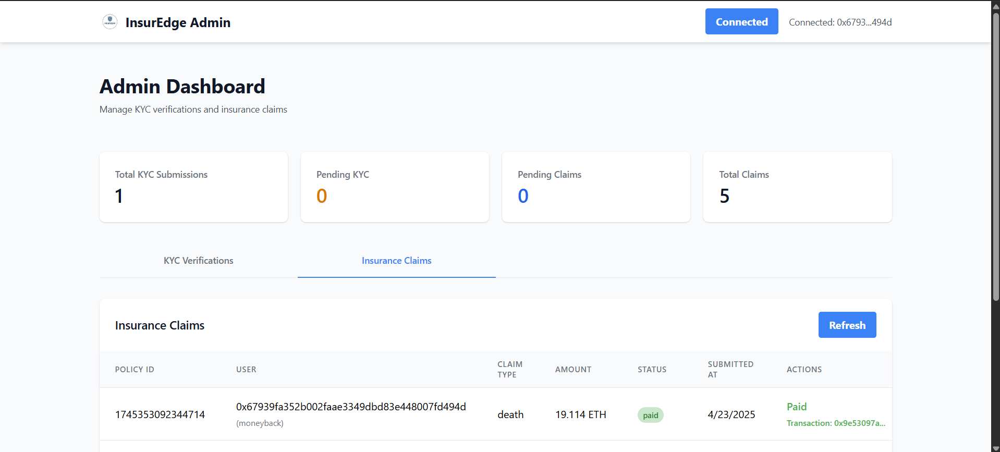

# 🛡️ INSUREDGE – Blockchain-Based Insurance System

**INSUREDGE** is a decentralized insurance platform that leverages Ethereum smart contracts, IPFS, and Web3 technologies to create a secure, transparent, and automated insurance ecosystem.

> 💡 Empowering trustless insurance with blockchain, one smart contract at a time.

---

## 📸 Project Screenshots

### 🔐 Login Page

### 🏠 Home Page

### 📃 Term Life Insurance Policy

### 💰 Policy Purchase Flow

### 📤 Claim Submission Form

### 📊 Admin Dashboard

---

## 🚀 Features

- 🧾 Smart contract-based Term Life & Money Back Insurance
- 🔐 Decentralized KYC and claims storage via IPFS + Pinata
- 🪙 MetaMask integration for on-chain transactions
- 📦 Secure document upload using Multer
- 🔑 JWT-authenticated login for policyholders and admins
- 📡 RESTful API with Node.js + Express
- 📁 MongoDB Atlas for off-chain metadata
- 🛠 Modular MVC architecture with microservices

---

## 🧱 Tech Stack

### 💻 Frontend
- HTML5, CSS3, JavaScript (ES6+)
- Tailwind CSS for UI
- Web3.js + Ethers.js for blockchain interaction
- MetaMask (wallet)

### 🔐 Backend
- Node.js, Express.js
- MongoDB Atlas (cloud DB)
- Multer (file uploads)
- JWT (authentication)

### ⛓️ Blockchain
- Ethereum (Smart Contracts in Solidity)
- Truffle Suite + Ganache for testing
- Pinata (IPFS file storage)

---

## ⚙️ System Architecture

## 🧪 Core Workflows

### 1. 🔐 User Registration + KYC Upload
- Documents uploaded → stored in IPFS → CID stored on-chain

### 2. 📃 Policy Purchase
- Choose Term Life or Money Back policy → Smart contract assigns terms

### 3. 💳 Premium Payment
- Pay securely via MetaMask → Blockchain records transaction

### 4. 💼 Claim Submission
- Upload claim docs → IPFS stores → Contract validates & settles

---

## 🖥️ How to Run Locally

### 1. Clone Repo
git clone https://github.com/ponvishal03/INSUREDGE.git
cd INSUREDGE

### 2. Install Dependencies
npm install

### 3. Compile Smart Contracts
truffle compile

### 4. Migrate Smart Contracts
truffle migrate --network development

### 5. Start Backend Server
node server.js

### 👨‍💻 Project Contributors
 
Kaustubh Mhatre, 
Ponvishal Nadar

Guided by: Prof. Suhas Lawand
📍 Xavier Institute of Engineering, Mumbai

### 📬 Contact
📧 ponvishal03@gmail.com
